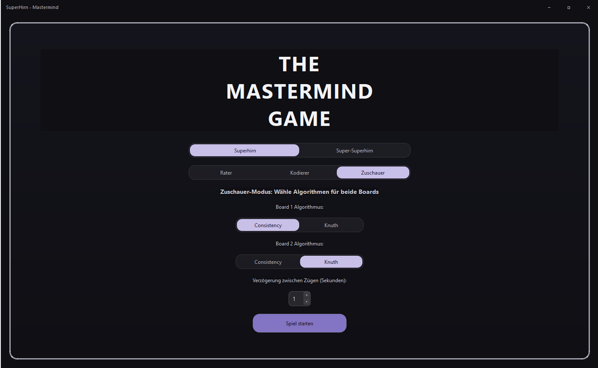
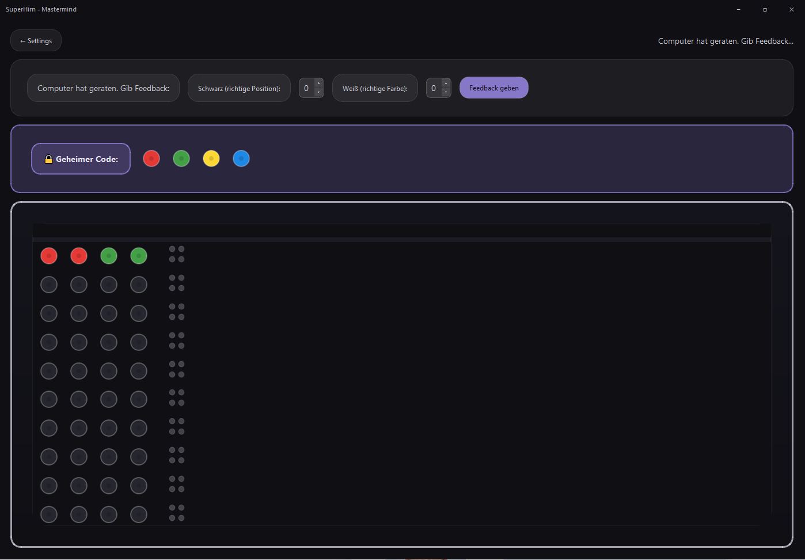
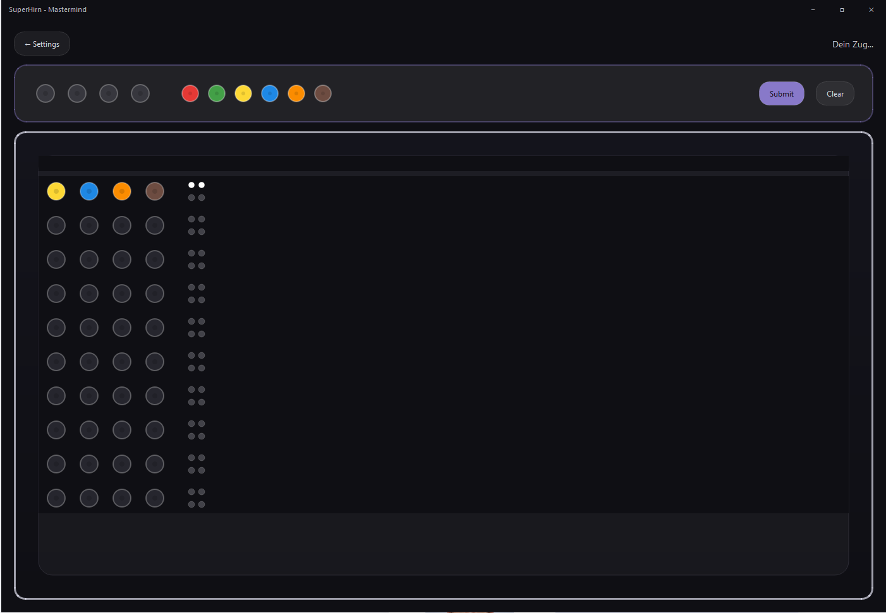
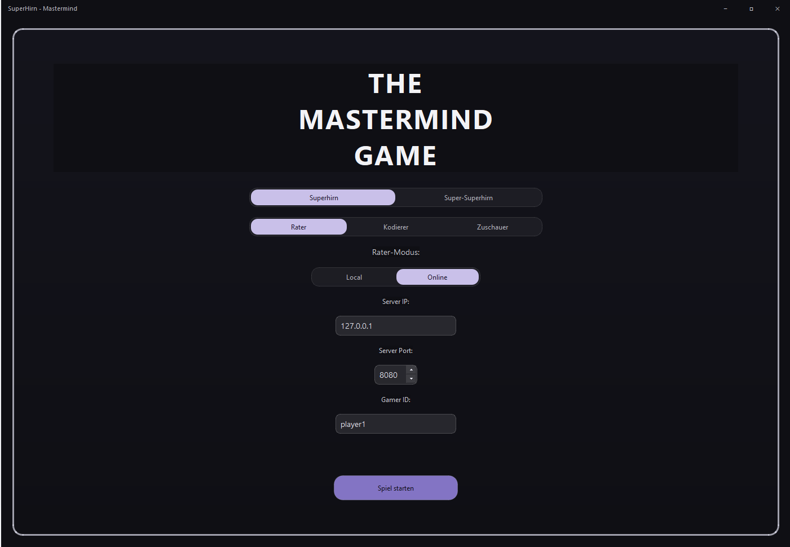

# SuperHirn (Python / PySide6)

**SuperHirn** ist ein Mastermind-ähnliches Spiel in Python.
Der Spieler versucht, einen geheimen Farbcode zu erraten und erhält nach jedem Zug Feedback.

Die Anwendung bietet:

* Modulare Architektur (Domain, Control, Implementation, UI)
* Grafische Oberfläche mit **PySide6 (Qt)**
* Möglichkeit, die Anwendung als **Windows-Executable (.exe)** zu bauen

---

## Screenshots

### Main Menu



*Hauptmenü zur Auswahl der verschiedenen Spielmodi.*

---

### Kodiermodus



*Modus zur Erstellung und Verwaltung des geheimen Farb-Codes.*

---

### Ratermodus



*Spielmodus, in dem der Code durch logisches Kombinieren erraten wird.*

---

### Zuschauermodus


*Visualisierung des Spielverlaufs ohne aktive Teilnahme.*

---

### Online-Modus



*Netzwerkbasierter Spielmodus mit Client-Server-Kommunikation.*

---

## Projektstruktur (Kurzüberblick)

* `CoreDomainModel/` – Domänenklassen & Interfaces
* `ApplicationControl/` – Steuerlogik (Controller, Synchronisation, …)
* `Implementation/` – Algorithmen & Provider
* `UI/` – Benutzeroberfläche (Views, Components, Threads, Utils, …)
* `Networking/` – Netzwerkfunktionen (optional)
* `app/` – Hauptfenster, Styles, UI-Basisklassen
* `Test/` – Tests
* `main.py` – Einstiegspunkt der Anwendung
* `SuperHirn.spec` – PyInstaller-Konfiguration für den Build

---

## Voraussetzungen

* **Python 3.10 oder höher**
* **PyCharm** (empfohlen, aber nicht zwingend)
* Windows (für den `.exe`-Build)

> Hinweis: Ordner wie `.venv/`, `dist/`, `build/` und `__pycache__/` gehören nicht ins Repository.

---

# Anwendung aus dem Quellcode starten (main.py)

## Schritt 1: Projekt klonen

### Option A – Mit PyCharm

1. PyCharm starten → **Get from VCS**
2. GitLab-Repository-URL einfügen
3. **Clone**

### Option B – Mit Terminal

```bash
git clone <REPOSITORY_URL>
cd superhirn
```

---

## Schritt 2: Virtuelle Umgebung erstellen

### In PyCharm

1. **File → Settings → Project → Python Interpreter**
2. **Add Interpreter → Virtualenv → New**
3. Speicherort: Projektordner (`.venv`)
4. **OK**

---

## Schritt 3: Abhängigkeiten installieren

Im Terminal (oder PyCharm-Terminal):

```bash
pip install -r requirements.txt
```

---

## Schritt 4: Anwendung starten

### In PyCharm

1. `main.py` öffnen
2. Rechtsklick → **Run 'main'**

### Im Terminal

```bash
python main.py
```

➡ Die grafische Oberfläche von **SuperHirn** startet.

---

# Tests ausführen

## Schritt 5: Tests starten

### Im Terminal

```bash
python -m unittest
```

### In PyCharm

* Rechtsklick auf den Ordner `Test/` → **Run**

---

# Anwendung als Windows-Executable (.exe) bauen

Mit PyInstaller kann das Projekt in eine eigenständige Windows-Anwendung umgewandelt werden.

## Schritt 6: PyInstaller installieren (falls noch nicht vorhanden)

```bash
pip install pyinstaller
```

---

## Schritt 7: Build starten

Im Projekt-Root:

```bash
pyinstaller SuperHirn.spec --clean
```

---

## Schritt 8: Ergebnis ausführen

Nach erfolgreichem Build findest du die ausführbare Datei unter:

```
dist/SuperHirn/SuperHirn.exe
```

### Programm starten:

* Doppelklick auf **SuperHirn.exe**
* Oder über die Konsole:

```bash
dist\SuperHirn\SuperHirn.exe
```

➡ Die Anwendung läuft nun **ohne Python-Installation** auf dem Rechner.

---

# Hinweise

* Falls beim Starten Fehler auftreten:

  * Prüfe, ob `requirements.txt` korrekt installiert wurde
  * Stelle sicher, dass **PySide6** (nicht PyQt6) verwendet wird
* Einstiegspunkt der Anwendung ist immer: `main.py`
* Beim Build werden alle notwendigen Qt-Module automatisch eingebunden

---

## Lizenz

Dieses Projekt dient zu Lern- und Demonstrationszwecken.
